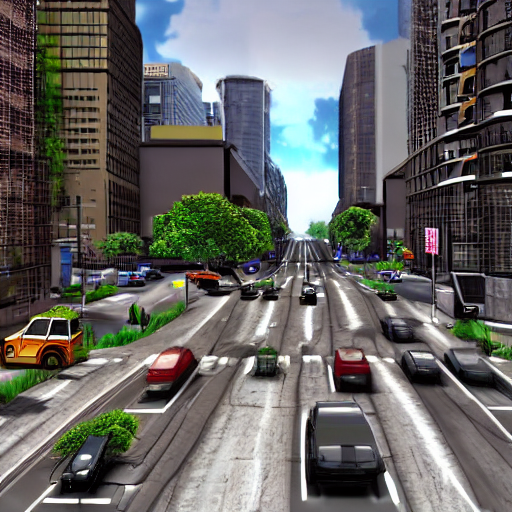

# Synthetic Driving Data Generation Project

A personal project exploring diffusion-based image generation using Stable Diffusion, with a focus on creating synthetic driving scene datasets and basic visual analysis.

## Overview

This project uses Stable Diffusion (via the Hugging Face `diffusers` library) to generate a labelled synthetic dataset of driving scenes across varying weather, road, and traffic conditions. A two-stage pipeline — text-to-image followed by image-to-image refinement — is used to produce realistic, high-detail images. Basic computer vision analysis is then applied to the generated output.


(*This is an unfinished project and requires further refinement. Created for personal development! Thank you!*)

## What This Project Does

- Generates realistic driving scenes using Stable Diffusion
- Applies image-to-image diffusion to refine and improve realism
- Simulates variations in:
  - Weather (sunny, rainy, foggy, night)
  - Scene type (urban, highway, intersection)
  - Traffic density
- Automatically creates a labeled dataset for downstream tasks
- Demonstrates a basic synthetic data pipeline for autonomous driving

## Key Features

- Text-to-image and image-to-image diffusion
- Structured dataset generation (weather, scene, traffic)
- Automated labeling pipeline
- GPU-accelerated (CUDA) inference using PyTorch

## Scripts (methodology)

### `generate.py`- Dataset Generation

Generates a labelled dataset of synthetic driving scenes using a two-stage Stable Diffusion pipeline:

1. **Stage 1 (Text-to-Image)**: Generates a base driving scene from a simple structural prompt.
2. **Stage 2 (Image-to-Image)**: Refines the base image with a detailed prompt incorporating weather, lighting, and photorealism cues.

The script iterates over all combinations of the following scene parameters:

| Parameter | Values |
|-----------|--------|
|  Weather  | sunny, rainy, foggy, night |
|  Scene    | urban street, highway, intersection|
|  Traffic  | low, moderate, heavy|

This produces 36 images in total, saved to `dataset/` alongside a `labels.csv` file mapping each image to its generation parameters.

Key settings:

- Model: `runwayml/stable-diffusion-v1-5`
- Img2img strength: `0.6`
- Guidance scale: `7.5`
- Attention slicing enabled for memory efficiency
- Automatically uses GPU if available (`cuda`), otherwise falls back to CPU

### `analysis.py` - Image Analysis

Applies edge detection to a generated image using OpenCV's Canny algorithm and visualises the result with Matplotlib.

## Requirements

- Python 3.8+
- PyTorch (with CUDA support recommended)
- `diffusers` (library)
- `transformers` (library)
- OpenCV (`opencv-python`)
- `MatPlotLib` (library)
- `Pillow` (library)

Install dependencies:

```python
pip install torch torchvision diffusers transformers accelerate opencv-python matplotlib pillow
```

## Usage

### Generate the dataset

In bash:

```bash
python generate.py
```

This will clear any existing `dataset/` folder, regenerate all 36 images, and write `dataset/labels.csv`.

### Run analysis

In bash:

```bash
python analysis.py
```
This displays an edge-detected version of `dataset/img_0.png`.

### Output

After running `generate.py`, the `dataset/` directory will contain:

- `img_0.png` through `img_35.png` — generated driving scene images.
- `labels.csv` — CSV file with columns: `filename`, `weather`, `scene`, `traffic`.

An example of this image is given below:

 
Figure 1: An initial test image created

## Notes

- A GPU with at least 6GB VRAM is recommended for reasonable generation speed. CPU inference is supported but will be significantly slower.
- The `dataset/` directory is fully overwritten on each run of `generate.py`.
- This project is intended for personal experimentation and learning.

## Limitations

- Images are perfectly realistic (no domain specific fine-tuning).
- No semantic annotations.
- Limited control compared to advanced tools (e.g., CARLA, ControlNet).

## Learning Goals

- Understood diffusion models in practice.
- Built end-to-end ML pipelines.
- Explored synthetic data generation workflows.
- Connected generative AI with real-world engineering problems.

## Future Work

 - Add more scene parameters (e.g. time of day, road surface).

 - Train or fine-tune a classifier on the generated dataset.

 - Generate semantic labels automatically.

 - Add a visualisation script for the full dataset grid.
